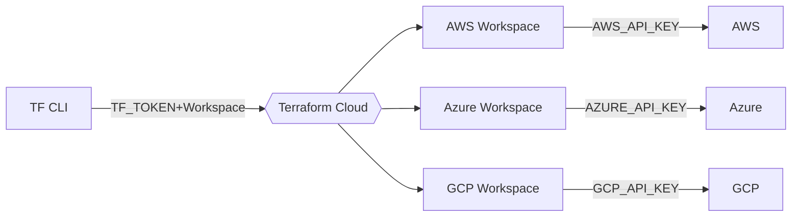
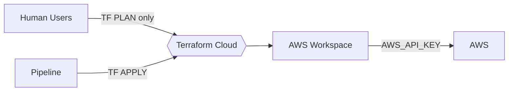

# tfc-admin-management


## Description

This is an example repo to manage [Teraform Cloud (TFC)](https://cloud.hashicorp.com/products/terraform) via the [Terraform TFE provider](https://registry.terraform.io/providers/hashicorp/tfe/). This was created to show what is possible when you want to administrate Terraform Cloud (or Terraform Enteprise) via Config As Code! 

This is meant to be an example and intended for others to gain insight. 


## Scenario/Workflow

This repository assumes a TFC admin team will be responsible for managing TFC teams, workspaces, sentinel policies, cloud run agent pools for the rest of the organisation. They have defined a workflow for interacting/utilising TFC that they and the rest of their organisation will follow.

### TFC Remote CLI Workflow



### Team Users and workspace Permissions

1. Human users are allowed to perform TF Plans but must check in their TF code (eg Pull requests) into a pipeline/CICD tool for changes to be applied. This allows human users to test locally their TF code and follow the CLI Workflow. Their user will only be in a TFC team that only has PLAN only permissions.
2. A pipeline/CICD tool will perform the Apply and will receive a TFC Team token that has permission to apply to that workspace. 




## Adding more teams to TFC

TFC Admins or other teams can self service by adding another module definition for a team.

```terraform
module "aws-team" {
  source         = "./modules/teams"
  teamname       = "app-service"
  workspaces     = ["app-service-dev", "app-service-dev-iam-profiles", "app-service-dev-domain-names", "app-service-prod"]
  workspace-tags = ["aws", "app-service"]
  organization   = "tfc_org_name"
}

```

### Team Sub Module

The team submodule will create the following:

- Two TFC teams
-- One for users
-- One for Pipeline
- All the workspaces listed with workspace tags attached
-- Provide team access to the Users team with PLAN permissions to workspaces
-- AProvide team accessto the Pipeline team with APPLY permissions to workspaces


# To Do/Experiment

- Can we add more settings under workspaces through this method?
-- eg. [Adding/sharing remote state](https://registry.terraform.io/providers/hashicorp/tfe/latest/docs/resources/workspace#remote_state_consumer_ids) to other consumer workspaces. Might be able to utilise [data.workspace_ids](https://registry.terraform.io/providers/hashicorp/tfe/latest/docs/data-sources/workspace_ids)?
- What settings are best kept in the UI?
-- eg. TF version of a workspace, let teams or TFC admins manage that per workspace in the UI. 
- Integrate HCP Vault to retrive secrets
- Setup Variable sets (maybe seperate state file/repo)
- Could VCS Workflow also be provisioned with the current module setup?
